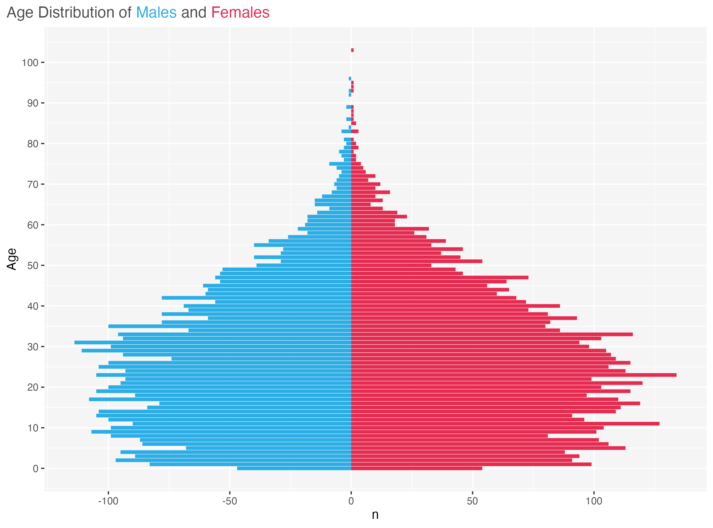
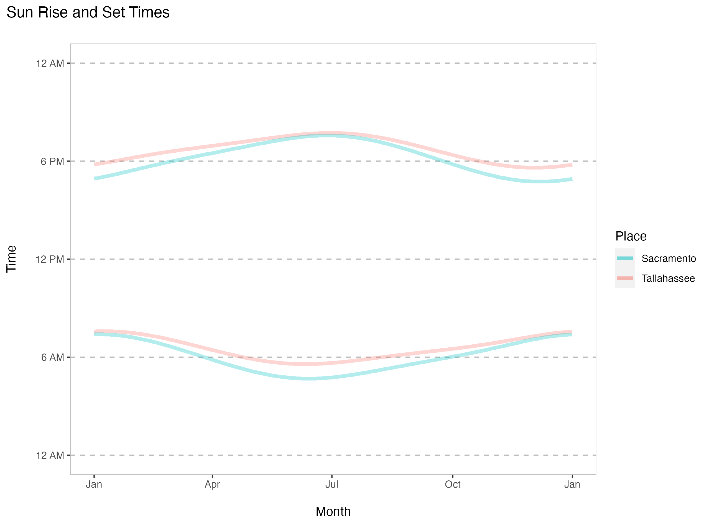
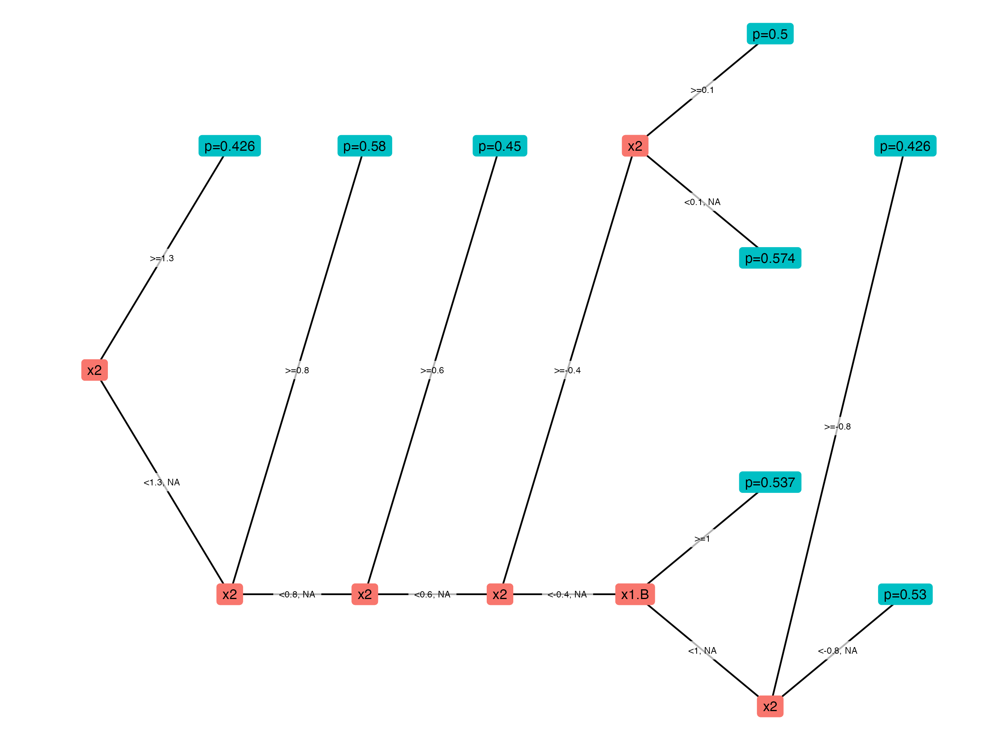

Sundry Snippets
================

Here you’ll find useful bits of (mostly) R code. Some examples:

## Population pyramid plot function

Find the code
[here](https://github.com/martymasek/sundry_snippets/blob/main/code/population_pyramid_function.R).

   

## Sunrise and Sunset Times

Gets data from the U.S. Navy’s API for one year in different locations.
Here is a plot of two locations.

Find the code
[here](https://github.com/martymasek/sundry_snippets/blob/main/code/sun_rise_set_times.R).

   

## 5-year age group crosswalk

Example of first 15 rows shown below.

Find the code
[here](https://github.com/martymasek/sundry_snippets/blob/main/code/create_age_group_xwalk.R).

| age | age_group_5yr |
|----:|:--------------|
|   0 | 0-4           |
|   1 | 0-4           |
|   2 | 0-4           |
|   3 | 0-4           |
|   4 | 0-4           |
|   5 | 5-9           |
|   6 | 5-9           |
|   7 | 5-9           |
|   8 | 5-9           |
|   9 | 5-9           |
|  10 | 10-14         |
|  11 | 10-14         |
|  12 | 10-14         |
|  13 | 10-14         |
|  14 | 10-14         |

   

## Tree plot from h2o model

Outputs a ggplot object.

Find the code
[here](https://github.com/martymasek/sundry_snippets/blob/main/code/plot_h2o_tree.R).

