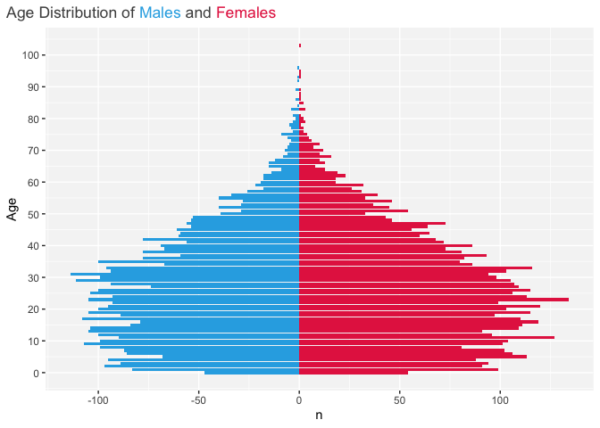

Sundry Snippets
================

Here you’ll find useful bits of (mostly) R code. Feel free to use what
is helpful.

   

Some examples:

## Population pyramid plotting

code
[here](https://github.com/martymasek/sundry_snippets/blob/main/population_pyramid_function.R)

<!-- -->

   

## 5-year age group crosswalk

example of first 20 rows, code
[here](https://github.com/martymasek/sundry_snippets/blob/main/create_age_group_xwalk.R)

| age | age_group_5yr |
|----:|:--------------|
|   0 | 0-4           |
|   1 | 0-4           |
|   2 | 0-4           |
|   3 | 0-4           |
|   4 | 0-4           |
|   5 | 5-9           |
|   6 | 5-9           |
|   7 | 5-9           |
|   8 | 5-9           |
|   9 | 5-9           |
|  10 | 10-14         |
|  11 | 10-14         |
|  12 | 10-14         |
|  13 | 10-14         |
|  14 | 10-14         |
|  15 | 15-19         |
|  16 | 15-19         |
|  17 | 15-19         |
|  18 | 15-19         |
|  19 | 15-19         |
